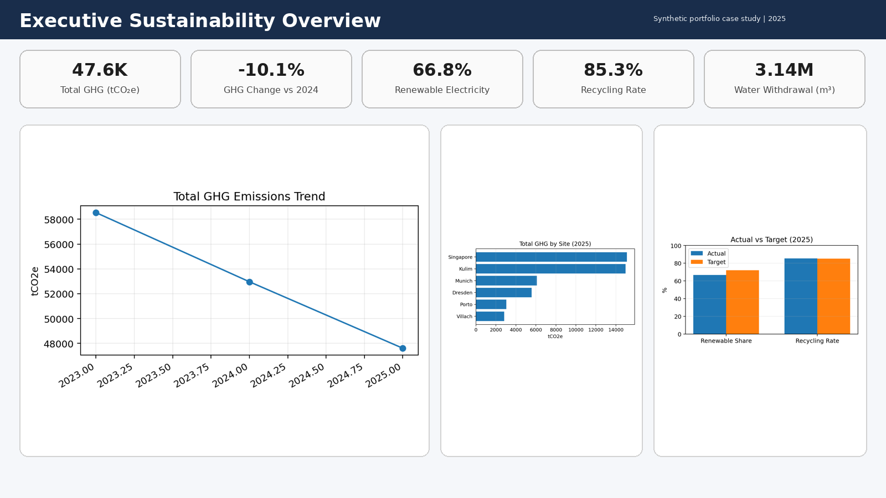
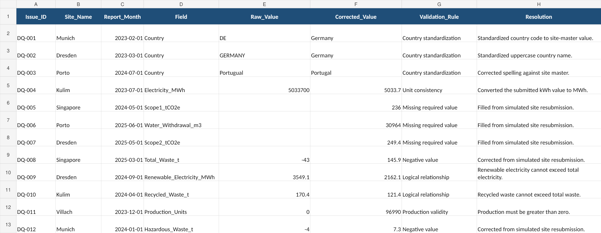
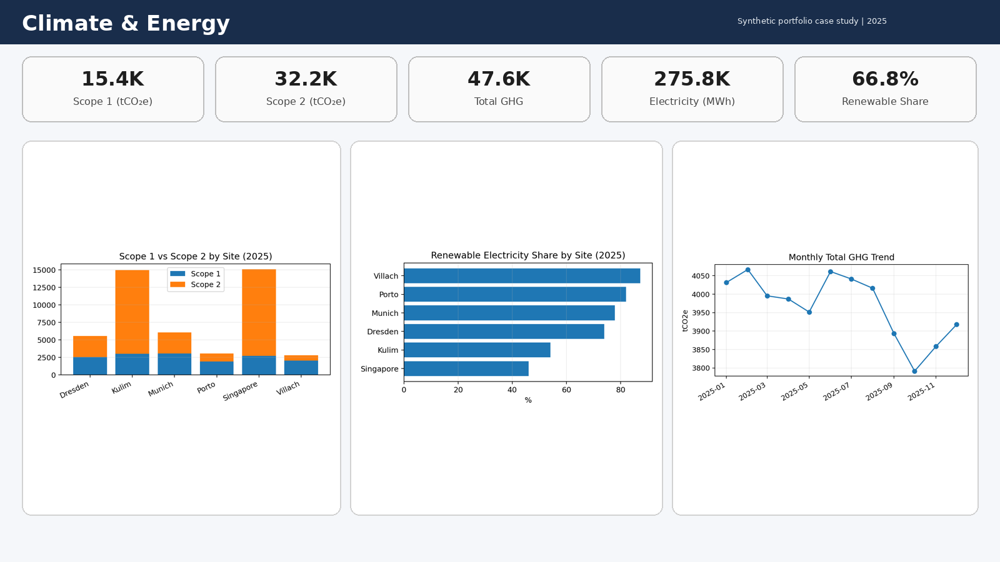
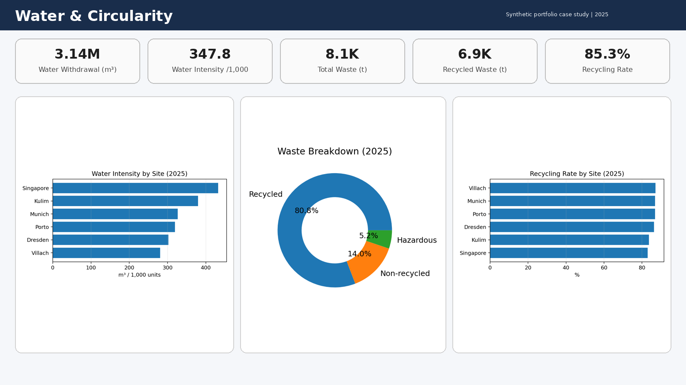
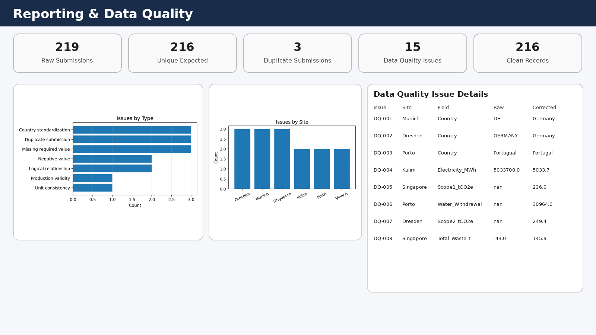
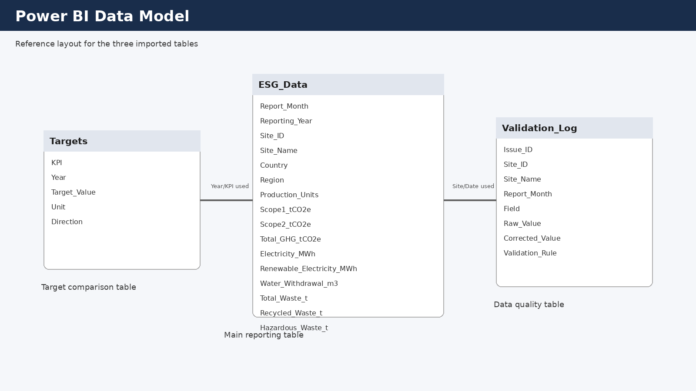

# Corporate Sustainability Reporting & ESG Analytics

> Independent student portfolio project using a fictional company and fully synthetic environmental data.

I built this project to practice a question that comes up in **sustainability reporting, ESG analytics, business intelligence and data-quality roles**:

**How do you turn monthly environmental data from different sites into reporting that is clean, consistent and useful for management?**

Instead of starting with the dashboard, I treated the project as a small end-to-end reporting process: raw site submissions, validation, correction, KPI calculation and management reporting.

---

## Project at a glance

- **6** simulated manufacturing sites
- **2023–2025** monthly reporting period
- **219** raw submissions
- **216** expected unique site-month records
- **15** documented data-quality issues
- **3** duplicate submissions identified
- **216** validated records in the final clean dataset

### 2025 reporting results

- **47,613.3 tCO₂e** Scope 1 + Scope 2 GHG emissions
- **-10.1%** GHG change compared with 2024
- **66.8%** renewable electricity share
- **85.3%** recycling rate
- **3,142,731 m³** water withdrawal



---

## The business problem

For this case study, I created a fictional manufacturer called **GreenCore Technologies GmbH** with six sites:

- Munich
- Dresden
- Villach
- Porto
- Singapore
- Kulim

Each site submits monthly environmental information such as energy consumption, Scope 1 and Scope 2 emissions, water withdrawal and waste.

The problem is that real reporting processes are rarely perfectly clean. To make the case more realistic, I introduced issues such as:

- inconsistent country names
- missing values
- incorrect units
- negative values
- impossible relationships between KPIs
- duplicate submissions

The goal was to create a simple reporting workflow that could detect these issues before the numbers reached a management dashboard.

---

## What I did

### 1. Created the raw reporting dataset

The starting dataset contains **219 rows** covering six manufacturing sites over three years.

The expected number of unique submissions is:

`6 sites × 36 months = 216 site-month records`

The extra three rows are deliberate duplicate submissions.

The raw file is kept unchanged so there is always a clear **before** state.

**File:** `Data/01_environmental_data_raw.csv`

---

### 2. Built a validation log

Instead of silently replacing incorrect values, I created a separate validation log.

For every issue, the log records:

- issue ID
- site
- reporting month
- affected field
- original value
- corrected value
- validation rule
- resolution
- correction basis

This was one of the most useful parts of the project for me because it made the reporting process feel more like **data governance** rather than only data cleaning.



Examples of issues included:

- `DE` and `GERMANY` standardized to `Germany`
- `Portugual` corrected to `Portugal`
- electricity reported in kWh converted to MWh
- missing emissions and water values corrected using simulated site resubmissions
- negative waste values corrected
- renewable electricity greater than total electricity corrected
- recycled waste greater than total waste corrected
- three duplicate submissions resolved by retaining the latest submission

**File:** `Data/02_validation_log.csv`

---

### 3. Produced the clean dataset

After the validation and duplicate-resolution steps, the dataset contains:

**216 validated site-month records**

This is the version that should be used for reporting rather than the original raw submissions.

**File:** `Data/03_environmental_data_clean.csv`

---

### 4. Prepared the reporting model

I then created an analysis-ready dataset with additional reporting fields such as:

- reporting year
- reporting quarter
- month
- total GHG emissions
- renewable electricity share
- recycling rate
- emissions intensity
- water intensity

The main idea was to separate the raw reporting layer from the analysis layer.

**File:** `Data/04_powerbi_model_input.csv`

The data flow is:

```text
Raw Site Submissions
        ↓
Validation Log
        ↓
Clean Dataset
        ↓
KPI Calculations
        ↓
Reporting Model
        ↓
Management Dashboard
```

---

## Executive Sustainability Overview

The executive view is designed to answer the first questions a manager would normally have:

- Are emissions improving?
- How much electricity comes from renewable sources?
- How are sites performing against each other?
- Are we meeting sustainability targets?
- Which KPIs need more attention?


For 2025, the model reports:

| KPI | 2025 Result |
|---|---:|
| Scope 1 + Scope 2 GHG | 47,613.3 tCO₂e |
| GHG change vs 2024 | -10.1% |
| Renewable electricity share | 66.8% |
| Recycling rate | 85.3% |
| Water withdrawal | 3,142,731 m³ |

---

## Climate & Energy Analysis

The climate and energy view focuses on:

- Scope 1 emissions
- Scope 2 emissions
- total GHG emissions
- electricity consumption
- renewable electricity
- renewable electricity share
- emissions performance by site



I wanted this section to make it easy to move from a group-level KPI to individual-site performance.

---

## Water & Circularity

The water and circularity view looks at:

- water withdrawal
- water intensity
- total waste
- recycled waste
- hazardous waste
- recycling rate
- site-level differences



This helped me practice the difference between an **absolute KPI** and an **intensity KPI**. A large site may naturally use more water, so looking at water relative to production can provide additional context.

---

## Reporting & Data Quality

I also created a separate reporting-quality view because a sustainability dashboard is only useful if the underlying information is reliable.

The project tracks:

- **219** raw submissions
- **216** expected unique records
- **15** documented quality issues
- **3** duplicate submissions
- **216** final clean records



For me, this was an important takeaway from the project: **good reporting is not just about making charts. It also means being able to explain where the numbers came from and what happened when the data was wrong.**

---

## Reporting model

The project separates the main environmental reporting data from supporting information such as sustainability targets and the validation log.



The repository currently contains the prepared data model and dashboard/reporting views. The focus of this project is the **reporting logic, data-quality workflow and KPI structure** rather than presenting it as a deployed production reporting system.

---

## Sustainability targets

The synthetic target table allows actual performance to be compared with annual goals.

Examples include:

- total GHG emissions
- renewable electricity share
- recycling rate
- water intensity

**File:** `Data/06_sustainability_targets.csv`

This helped me think about dashboards as a decision tool rather than simply a place to display historical numbers.

---

## KPI dictionary

I also created a small KPI dictionary so that each reporting metric has a consistent definition.

It includes:

- KPI name
- unit
- reporting frequency
- calculation
- suggested owner
- source information
- selected ESRS topic mapping

**File:** `Data/07_esg_kpi_dictionary.csv`

The selected ESRS references are used only as an educational reporting framework. This project is **not** presented as a full ESRS or CSRD compliance assessment.

---

## Main files

### `Data/`

| File | Purpose |
|---|---|
| `01_environmental_data_raw.csv` | Original simulated monthly site submissions |
| `02_validation_log.csv` | Audit trail of all documented reporting issues |
| `03_environmental_data_clean.csv` | Validated dataset after corrections and duplicate resolution |
| `04_powerbi_model_input.csv` | Reporting-ready dataset with calculated KPI fields |
| `05_site_master.csv` | Standard site, country and region information |
| `06_sustainability_targets.csv` | Synthetic annual sustainability targets |
| `07_esg_kpi_dictionary.csv` | KPI definitions and selected ESRS topic mapping |
| `08_2025_site_summary.csv` | Derived site-level summary for 2025 |

### `Docs/`

`Sustainability_Reporting_Methodology.pdf`

This document explains the project scope, KPI logic, validation approach and reporting assumptions.

### `Screenshots/`

Contains the main reporting and data-quality views used in the case study.

---

## Skills demonstrated

### Data & reporting
- data cleaning and validation
- KPI calculation
- data-quality checks
- reporting-model preparation
- management reporting
- dashboard design

### Sustainability
- Scope 1 and Scope 2 GHG reporting
- energy and renewable-electricity KPIs
- water and waste KPIs
- recycling metrics
- sustainability target tracking
- selected ESRS concepts

### Tools and methods
- Excel
- Power Query concepts
- Power BI reporting concepts
- data-quality validation
- audit trail documentation
- business-oriented KPI analysis

---

## What I learned

The biggest lesson from this project was that sustainability reporting is not only about calculating environmental KPIs.

A large part of the work happens **before** the final dashboard:

1. understanding what each field means,
2. checking whether values make sense,
3. standardizing information from different sites,
4. documenting corrections,
5. making sure KPI formulas are consistent,
6. and only then presenting the results.

I also learned why keeping the raw data separate from the clean reporting data is useful. If something changes later, the original submission is still available and the correction can be traced through the validation log.

---

## Limitations

This is an independent educational portfolio project.

- **GreenCore Technologies GmbH is fictional.**
- All operational and environmental data are synthetic.
- Corrected values are simulated for learning purposes.
- No real company information is used.
- Selected ESRS concepts are included for educational mapping only.
- The project does not represent a complete ESRS or CSRD compliance assessment.
- The dashboard images are portfolio reporting views and should not be interpreted as a live production system.

---

## Repository structure

```text
corporate-sustainability-reporting/
├── README.md
├── Data/
│   ├── 01_environmental_data_raw.csv
│   ├── 02_validation_log.csv
│   ├── 03_environmental_data_clean.csv
│   ├── 04_powerbi_model_input.csv
│   ├── 05_site_master.csv
│   ├── 06_sustainability_targets.csv
│   ├── 07_esg_kpi_dictionary.csv
│   └── 08_2025_site_summary.csv
├── Docs/
│   └── Sustainability_Reporting_Methodology.pdf
└── Screenshots/
    ├── 01_cleaning_audit_examples.png
    ├── Executive_Overview.png
    ├── Climate_Energy.png
    ├── Water_Circularity.png
    ├── Data_Quality.png
    └── PowerBI_Data_Model.png
```

---

**Note:** I created this project as a student portfolio case study to practice sustainability reporting, ESG data quality and business-oriented analytics in a way that I can explain clearly during Working Student and internship interviews.
